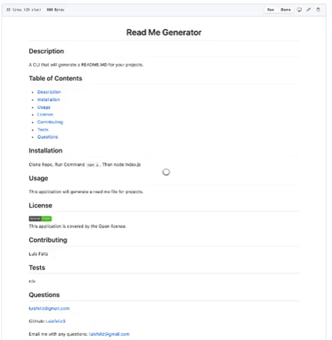

<h1 align="center">Read Me Generator</h1>
  
## Description
 A CLI that will generate a README.MD for your projects.
 
## Table of Contents
- [Description](#description)
- [Table of Contents](#table-of-contents)
- [Installation](#installation)
- [Usage](#usage)
- [License](#license)
- [Contributing](#contributing)
- [Tests](#tests)
- [Questions](#questions)
## Installation
 Clone Repo, Run Command `npm i`, Then node index.js
## Usage
 This application will generate a read me file for projects.
## License

  
 
This application is covered by the Open license. 
## Contributing
 Luis Feliz 
## Tests
 n/a
## Questions
 luisfeliz@gmail.com 
 
 GitHub:  
 
 Email me with any questions: luisfeliz@gmail.com  

  